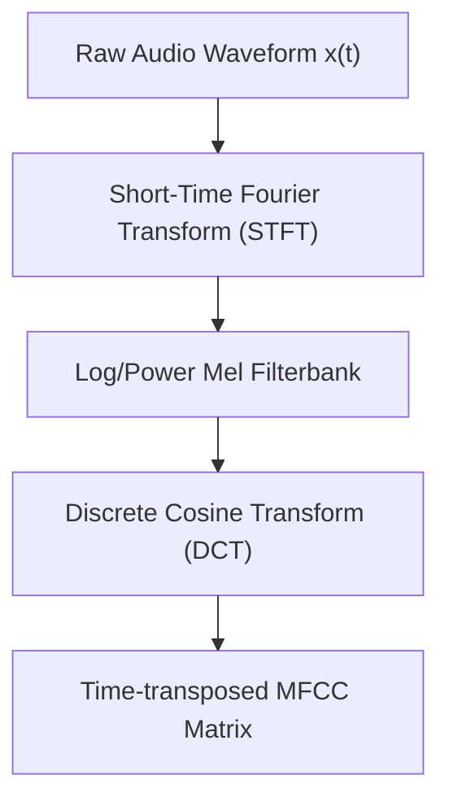
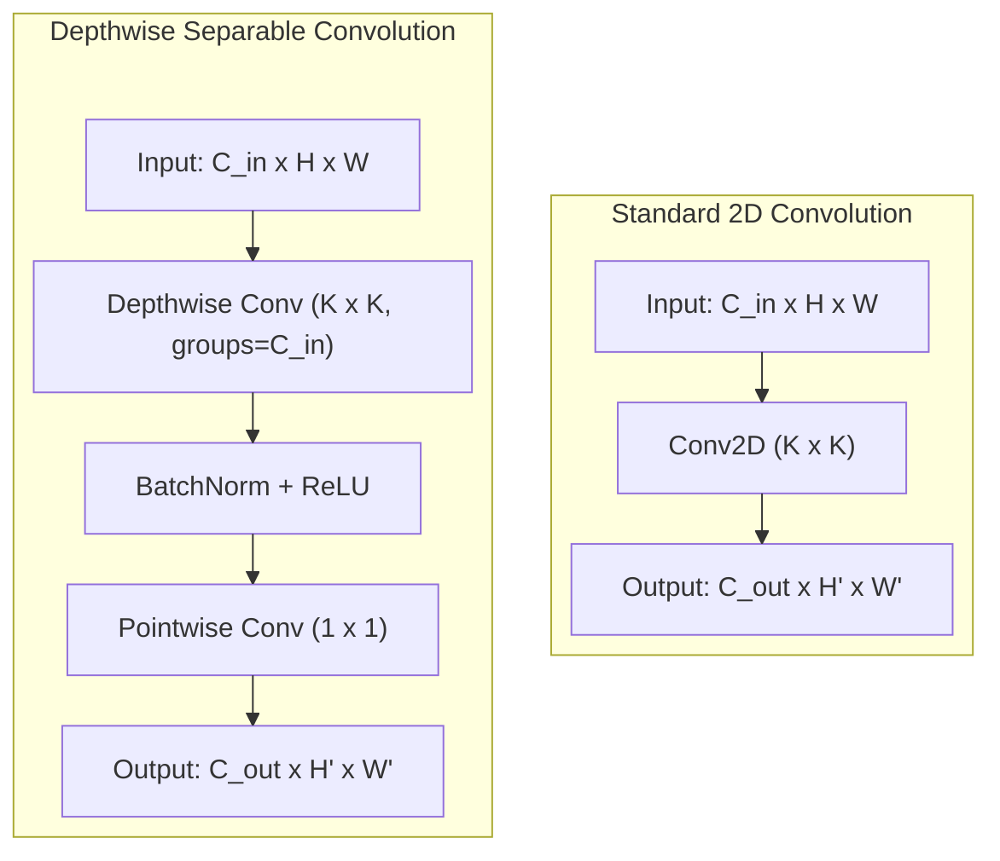
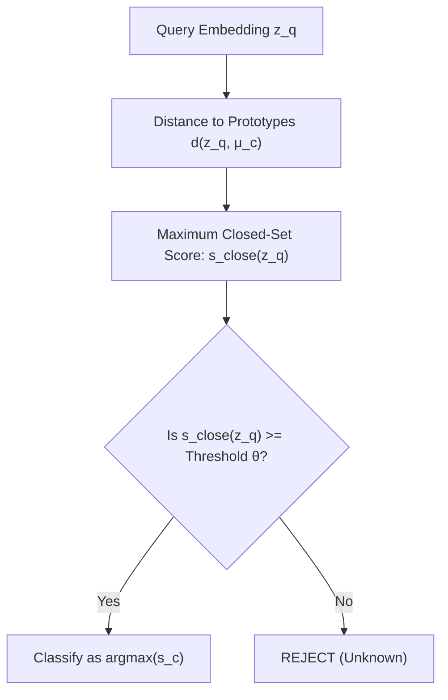

# Few-Shot Open-Set Keyword Spotting (KWS) on Low-Power Devices

This repository contains the implementation and evaluation of a **Few-Shot Open-Set Keyword Spotting (KWS)** system designed for highly efficient on-device customization. 

---

## 1. Problem Formulation & Task Definition

In **Few-Shot Open-Set Keyword Spotting**, we address two concurrent challenges:
1. **Few-Shot Adaptation ($K$-Shot Learning):** Customizing a pre-trained feature extractor to recognize a set of target keywords $C_{target}$ using only $K$ audio samples per keyword (typically $K \in \{1, 5\}$).
2. **Open-Set Rejection:** Robustly identifying and rejecting out-of-vocabulary (unknown) speech utterances $\mathcal{U}_{unknown}$ or background silence, preventing false activations.

### Mathematical Formulation
Let $\mathcal{X}$ be the domain of audio waveforms. Our system consists of:
1. A **Feature Extractor (Encoder)** $f_\theta: \mathcal{X} \to \mathbb{R}^D$ parameterized by weights $\theta$, mapping raw audio to a $D$-dimensional embedding space.
2. A **Nearest Class Mean (NCM) Classifier** that maps an embedding $\mathbf{z} \in \mathbb{R}^D$ to a predicted label $\hat{y} \in C_{target} \cup \{\text{unknown}\}$.

---

## 2. Feature Extraction & Audio Preprocessing Pipeline

Before feeding audio signals into the neural network, raw waveforms are converted to 2D time-frequency representations using **Mel-Frequency Cepstral Coefficients (MFCCs)**.

### The Preprocessing Mathematics
Given an audio waveform $x(t)$ sampled at $f_s = 16\text{ kHz}$:
1. **Framing & Windowing:** The signal is divided into overlapping frames of window size $W_{ms}$ (40ms, corresponding to $N_w = 640$ samples) and hop size $H_{ms}$ (20ms, corresponding to $N_h = 320$ samples). Each frame is multiplied by a Hamming window to minimize spectral leakage.
2. **Power Spectrogram:** For each framed window $x_i(t)$, a Discrete Fourier Transform (DFT) is calculated:
   $$X_i(k) = \sum_{n=0}^{N_{fft}-1} x_i(n) e^{-j \frac{2\pi}{N_{fft}} k n}$$
   The power spectrum is computed as:
   $$P_i(k) = \frac{1}{N_{fft}} |X_i(k)|^2$$
3. **Mel-Scale Filterbank:** $P_i(k)$ is passed through a Mel-filterbank consisting of $M$ triangular filters (e.g., $M=40$) spaced linearly on the Mel scale:
   $$Mel(f) = 2595 \log_{10}\left(1 + \frac{f}{700}\right)$$
   The Mel-frequency energy for frame $i$ and filter $m$ is given by:
   $$S_i(m) = \sum_{k} P_i(k) H_m(k)$$
4. **Cepstral Analysis (DCT):** A Discrete Cosine Transform (DCT-II) is applied to the Mel-frequency energies to decorrelate features, retaining the first $B$ cepstral coefficients (e.g., $B=10$):
   $$MFCC_i(b) = \sum_{m=1}^{M} S_i(m) \cos\left( \frac{\pi b (2m - 1)}{2M} \right), \quad b \in \{1, \dots, B\}$$
5. **Transposition:** The resulting representation is transposed from shape $(B \times T)$ to shape $(T \times B)$ to serve as the 2D input matrix for spatial-temporal convolutions.

---

## 3. Model Architecture: Depthwise Separable CNN (DSCNN)

To enable execution on low-power edge platforms, the encoder uses **Depthwise Separable Convolutions (DS-CNN)**. Standard 2D convolutions are factored into a spatial depthwise convolution and a pointwise channel-mixing convolution, drastically reducing Multiply-Accumulate (MAC) operations.

### Depthwise Separable Factorization Math
Let the input feature map be $\mathbf{I} \in \mathbb{R}^{C_{in} \times H \times W}$ and output be $\mathbf{O} \in \mathbb{R}^{C_{out} \times H' \times W'}$.
- **Standard Convolution Complexity (Parameters & Multiplies):**
  $$\text{Params}_{std} = K_t \times K_f \times C_{in} \times C_{out}$$
  $$\text{Ops}_{std} = K_t \times K_f \times C_{in} \times C_{out} \times H' \times W'$$
- **Depthwise Convolution (Spatial filtering per channel):**
  $$\mathbf{G}_{c}(i, j) = \sum_{m, n} \mathbf{K}_{depth}(c, m, n) \cdot \mathbf{I}_{c}(i+m, j+n), \quad c \in \{1, \dots, C_{in}\}$$
- **Pointwise Convolution (Linear channel mixture):**
  $$\mathbf{O}_{c'}(i, j) = \sum_{c} \mathbf{K}_{point}(c', c) \cdot \mathbf{G}_{c}(i, j), \quad c' \in \{1, \dots, C_{out}\}$$
- **Computational Savings:**
  $$\frac{\text{Ops}_{ds}}{\text{Ops}_{std}} = \frac{K_t \cdot K_f \cdot C_{in} \cdot H' \cdot W' + C_{in} \cdot C_{out} \cdot H' \cdot W'}{K_t \cdot K_f \cdot C_{in} \cdot C_{out} \cdot H' \cdot W'} = \frac{1}{C_{out}} + \frac{1}{K_t \cdot K_f}$$

### Final Embedding Representation
Following the convolutional layers, a **Global Average Pooling (GAP)** aggregates spatial-temporal features, followed by a projection and optional **$L_2$ Normalization** mapping the outputs to a unit hypersphere:
$$\mathbf{z} = \text{GAP}(\mathbf{O}) \in \mathbb{R}^{D}$$
$$\mathbf{z}_{norm} = \frac{\mathbf{z}}{\|\mathbf{z}\|_2} \quad \text{such that} \quad \|\mathbf{z}_{norm}\|_2 = 1$$

---

## 4. Episodic Metric Learning & Online Triplet Loss

Instead of traditional cross-entropy classification, the network is trained using an **episodic training protocol** optimizing a **Triplet Loss**. This forces the network to learn a generalizable distance metric where similar classes cluster together, and different classes are widely separated.

### Episodic Batching
During training, each batch is formulated as an **Episode** simulating a few-shot task:
1. Sample $N_{class}$ classes from the background training set.
2. For each class, sample $N_{sample}$ items (consisting of support and query subdivisions).

### Triplet Loss Formulation
Given a set of anchor ($\mathbf{z}_a$), positive ($\mathbf{z}_p$), and negative ($\mathbf{z}_n$) embeddings:
$$\mathcal{L}_{triplet} = \frac{1}{|\mathcal{T}|} \sum_{(a, p, n) \in \mathcal{T}} \max\left(0, d(\mathbf{z}_a, \mathbf{z}_p) - d(\mathbf{z}_a, \mathbf{z}_n) + m\right)$$
Where:
- $d(\mathbf{u}, \mathbf{v}) = \|\mathbf{u} - \mathbf{v}\|_2^2$ is the squared Euclidean distance.
- $m > 0$ represents the margin parameter enforcing minimum distance separating positive and negative classes.
- $\mathcal{T}$ is the set of mined triplets.

### Online Triplet Selection Mechanisms
To avoid computing loss over all $O(N^3)$ possible triplets (most of which yield zero loss), **Online Triplet Mining** is applied inside each episode:
1. **Hardest Negative:** For each anchor-positive pair $(\mathbf{z}_a, \mathbf{z}_p)$, find the negative sample $\mathbf{z}_n$ that minimizes $d(\mathbf{z}_a, \mathbf{z}_n)$:
   $$\mathbf{z}_n = \arg\min_{\mathbf{z}_j: y_j \neq y_a} d(\mathbf{z}_a, \mathbf{z}_j)$$
2. **Semihard Negative:** Find negative samples $\mathbf{z}_n$ that reside within the margin boundary:
   $$d(\mathbf{z}_a, \mathbf{z}_p) < d(\mathbf{z}_a, \mathbf{z}_n) < d(\mathbf{z}_a, \mathbf{z}_p) + m$$

---

## 5. Nearest Class Mean (NCM) Few-Shot Classifier

Once the feature extractor $f_\theta$ is trained, it is frozen. New keywords are registered on-device at inference time using the **Nearest Class Mean (NCM)** prototype formulation.

### Mathematical Formulation
Given $K$ support samples $\{\mathbf{x}_{c, i}\}_{i=1}^K$ for a target class $c \in C_{target}$:
1. **Prototype Construction:** The class prototype vector $\mathbf{\mu}_c$ is calculated as:
   $$\mathbf{\mu}_c = \frac{1}{K} \sum_{i=1}^K f_\theta(\mathbf{x}_{c, i})$$
2. **Incremental / Online Prototype Updating:** When new support samples are acquired sequentially, the prototype is updated on-line:
   $$\mathbf{\mu}_c^{(N_c)} = \frac{(N_c - 1)\mathbf{\mu}_c^{(N_c - 1)} + f_\theta(\mathbf{x}_{c, N_c})}{N_c}$$
   Where $N_c$ is the current count of observed support samples for class $c$.

---

## 6. Open-Set Classification & Rejection Logic

To reject out-of-vocabulary/unknown utterances, the NCM classifier calculates a distance-based metric and subjects it to thresholding.

### Classification Scores
The classification score for class $c$ is the negative distance metric:
$$s_c(\mathbf{z}_q) = \begin{cases}
- \|\mathbf{z}_q - \mathbf{\mu}_c\|_2, & \text{if Euclidean metric} \\
\cos(\mathbf{z}_q, \mathbf{\mu}_c) = \frac{\mathbf{z}_q \cdot \mathbf{\mu}_c}{\|\mathbf{z}_q\|_2 \|\mathbf{\mu}_c\|_2}, & \text{if Cosine metric}
\end{cases}$$

### Rejection Thresholding
For a query sample $\mathbf{z}_q$, the closed-set classification score is defined as the maximum similarity score among target (known) classes:
$$s_{close}(\mathbf{z}_q) = \max_{c \in C_{target}} s_c(\mathbf{z}_q)$$

The final predicted label $\hat{y}$ is determined via:
$$\hat{y} = \begin{cases}
\arg\max_{c \in C_{target}} s_c(\mathbf{z}_q), & \text{if } s_{close}(\mathbf{z}_q) \geq \theta \\
\text{unknown}, & \text{if } s_{close}(\mathbf{z}_q) < \theta
\end{cases}$$
Where $\theta$ is the rejection threshold.

---

## 7. Performance Evaluation Metrics

To thoroughly evaluate the KWS pipeline under open-set conditions, we measure performance using threshold-independent and threshold-dependent metrics.

### 1. Area Under the ROC Curve (AUROC)
The AUROC measures the overall quality of the closed-set confidence score $s_{close}(\mathbf{z}_q)$ in separating positive target classes from unknown out-of-vocabulary utterances. It is calculated by integrating the True Positive Rate (TPR) over the False Positive Rate (FPR) across all possible thresholds $\theta$:
$$\text{AUROC} = \int_{0}^{1} \text{TPR}(\text{FPR}^{-1}(u)) \, du$$

### 2. False Acceptance Rate (FAR) & False Rejection Rate (FRR)
Let:
- $N_{pos}$ be the number of positive target keyword samples in the query set.
- $N_{neg}$ be the number of unknown (out-of-vocabulary) negative samples.
- $\mathbb{I}(\cdot)$ be the indicator function.

For a chosen threshold $\theta$:
- **False Acceptance Rate (FAR):** Rate of out-of-vocabulary negative samples mistakenly accepted as one of the target keywords:
  $$\text{FAR}(\theta) = \frac{1}{N_{neg}} \sum_{i=1}^{N_{neg}} \mathbb{I}\left(s_{close}(\mathbf{z}_{neg, i}) \geq \theta\right)$$
- **False Rejection Rate (FRR):** Rate of target keyword positive samples mistakenly rejected as unknown:
  $$\text{FRR}(\theta) = \frac{1}{N_{pos}} \sum_{i=1}^{N_{pos}} \mathbb{I}\left(s_{close}(\mathbf{z}_{pos, i}) < \theta\right)$$

### 3. Accuracy @ 5% FAR
To evaluate KWS system performance under a strict false activation budget, we set the threshold $\theta$ dynamically such that $\text{FAR}(\theta) = 5\%$.
1. **Threshold Selection:** Find $\theta_{95}$ such that:
   $$\theta_{95} = \inf \{ \theta \mid \text{FAR}(\theta) \leq 0.05 \}$$
2. **Dynamic Evaluation:** Classify the query set using $\theta_{95}$ and measure the resulting classification accuracy on positive classes:
   $$\text{Accuracy}_{pos}(\theta_{95}) = \frac{1}{N_{pos}} \sum_{i=1}^{N_{pos}} \mathbb{I}\left(\hat{y}_i = y_i\right)$$

---

## 8. Experimental Results and Paper Comparison

We evaluated both trained representation models—the Convolutional DSCNN-L model (`results/dscnnlln/best_model.pt`) and the Vision Transformer model (`results/vit_experiment/best_model.pt`)—under open-set episodic configurations using the official evaluation script (`KWSFSL/test_fewshots_classifiers_openset.py`, 25 episodes, per-episode threshold averaging).

### Experimental Setup
* **Pretrained Backbones:**
  * **DSCNN-L:** 407k parameters, trained with Triplet Loss and Layer Normalization (NORM).
  * **ViT Transformer:** 4.9M parameters, trained with Triplet Loss, patch size (4,1), 8 heads, 6 layers.
* **Classifier:** openNearest Class Mean (openNCM) using Euclidean distance.
* **Evaluation Words Split (21 words):**
  * **Positive Target Set (In-Vocabulary):** `junior`, `lay`, `material`, `mixed`, `thomas`, `exist`, `fruit`, `girls`, `boys`, `break`, `educated`
  * **Negative Distractor Set (Out-of-Vocabulary / Unknown):** `offer`, `paid`, `increased`, `laughed`, `length`, `mayor`, `michael`, `traffic`, `flame`, `boss`

---

### 1. 5-Way 5-Shot Open-Set Classification Results
In this setup, the model classifies inputs into one of 5 positive target classes while rejecting out-of-vocabulary unknown words. Due to lower classification complexity (5 choices instead of 10), both models exceed the paper's 10-way benchmarks.

| Metric | Paper (5-shot 10-way) | **Our DSCNN-L (5-shot 5-way)** | **Our ViT (5-shot 5-way)** |
| :--- | :--- | :--- | :--- |
| **aucROC** | `93.0%` | **`95.55%`** (std 1.68%) | **`94.42%`** (std 2.15%) |
| **Accuracy @ 5% FAR (`acc_prec95`)** | `71.0%` | **`77.89%`** (std 6.83%) | **`76.84%`** (std 7.57%) |
| **False Rejection Rate (`frr_prec95`)** | `26.0%` | **`20.45%`** (std 7.67%) | **`21.22%`** (std 8.12%) |
| **Closed-Set Accuracy (`accuracy_pos`)** | — | **`93.47%`** (std 2.42%) | **`94.10%`** (std 4.88%) |

---

### 2. 10-Way 5-Shot Open-Set Classification Results
To establish a direct, head-to-head comparison with the reference paper, we evaluated both models in a 10-way classification setting.

| Metric | Paper (5-shot 10-way) | **Our DSCNN-L (5-shot 10-way)** | **Our ViT (5-shot 10-way)** |
| :--- | :--- | :--- | :--- |
| **aucROC** | `93.0%` | **`93.85%`** (std 1.63%) | `91.99%` (std 2.55%) |
| **Accuracy @ 5% FAR (`acc_prec95`)** | `71.0%` | **`71.79%`** (std 8.41%) | `63.45%` (std 10.34%) |
| **False Rejection Rate (`frr_prec95`)** | `26.0%` | **`26.06%`** (std 9.14%) | `34.33%` (std 11.41%) |
| **Closed-Set Accuracy (`accuracy_pos`)** | — | **`91.22%`** (std 3.06%) | `89.41%` (std 2.48%) |

---

### Key Discussion
* **DSCNN-L Matches Paper:** At 10-way, DSCNN-L meets or slightly exceeds the paper's benchmarks across all metrics (`aucROC` +0.85%, `acc_prec95` +0.79%, `frr_prec95` on par at 26.06%).
* **ViT Underperforms at 10-Way:** The ViT model falls below the paper's 10-way benchmarks (`aucROC` -1.01%, `acc_prec95` -7.55%, `frr_prec95` +8.33%). This is attributed to the lack of convolutional inductive bias: the ViT requires more data to learn spatial structure from MFCC features, and the 21-word MSWC evaluation vocabulary is insufficient for its 4.9M parameter capacity.
* **ViT Competitive at 5-Way:** At reduced task complexity (5-way), the ViT performs comparably to DSCNN-L, suggesting the Transformer architecture has learned meaningful representations but struggles with the harder open-set discrimination at higher N-way.
* **Inductive Bias Advantage:** The DSCNN-L's depthwise separable convolutions naturally exploit the grid-like spectrotemporal patterns in MFCC features, making it more parameter-efficient and robust for few-shot KWS on small vocabularies.

